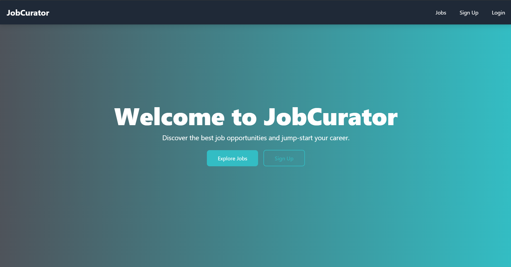
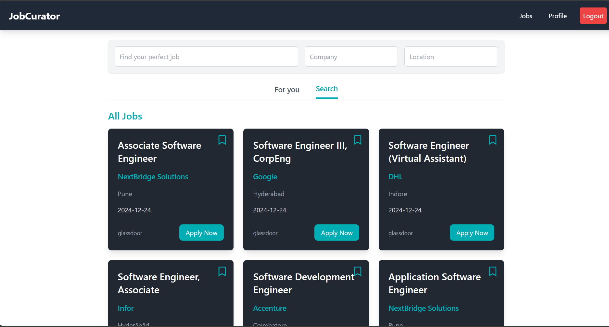
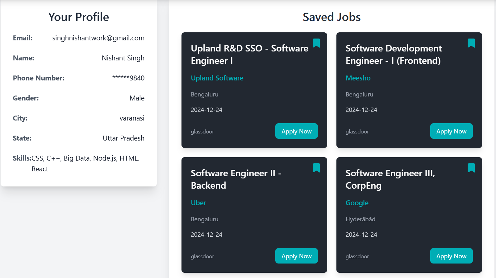
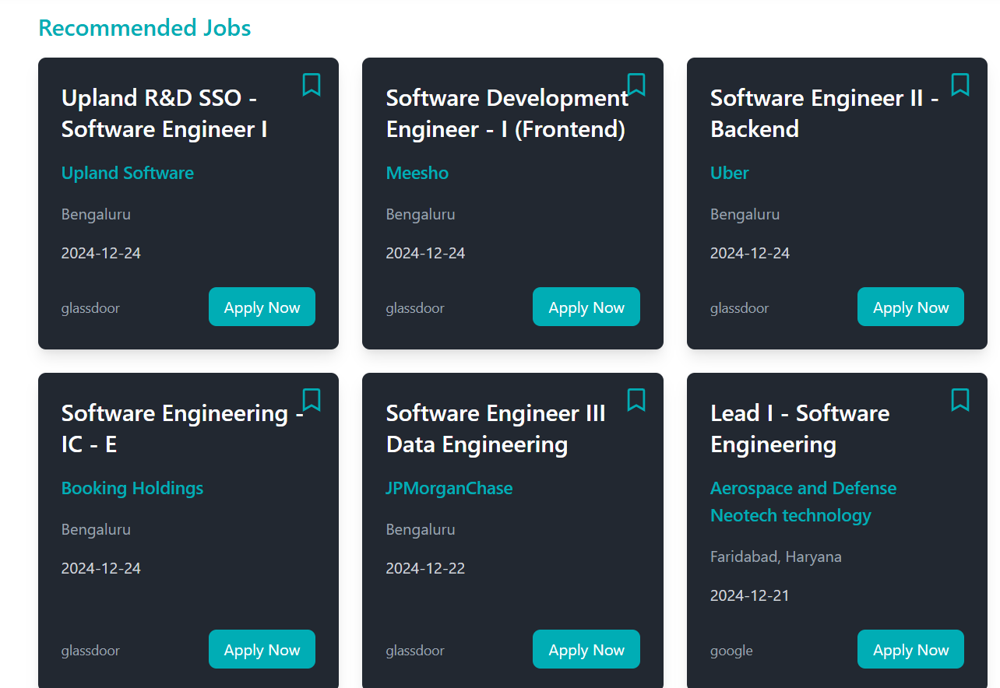

# Jobcurator Website

A web-based job portal where users can search and browse job listings. The site also includes features for user login, job recommendations, and saving job posts. Built with React, Spring Boot, PostgreSQL, and integrated with machine learning for personalized job suggestions.

## Features

- **Job Listings**: Display job listings scraped from various sources.
- **Job Search**: A search feature to find jobs based on keywords and filters.
- **User Authentication**: Signup, login, and logout functionality.
- **Saved Jobs**: Users can save job posts they are interested in.
- **Job Recommendations**: Machine learning-based job recommendations for users.
- **User Profile**: A personalized profile page for logged-in users.
- **Responsive Design**: The website is fully responsive and works well on all screen sizes.

## Screenshots

### Landing Page


### Job Listings


### Job Search


### User Profile and saved job


### Job Recommendations


### Login Page


### Signup Page


## Technologies Used

- **Frontend**: React, usestate
- **Backend**: Spring Boot
- **Database**: PostgreSQL
- **Machine Learning**: Python-based job recommendation model
- **Web Scraping**: Python (BeautifulSoup, Scrapy)

## Setup Instructions

1. Clone the repository:
   ```bash
   git clone https://github.com/Nishnat14/Job-curator.git
